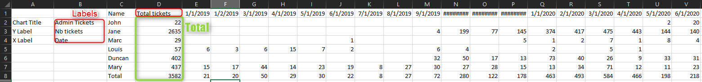
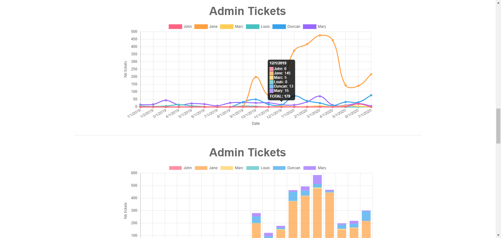
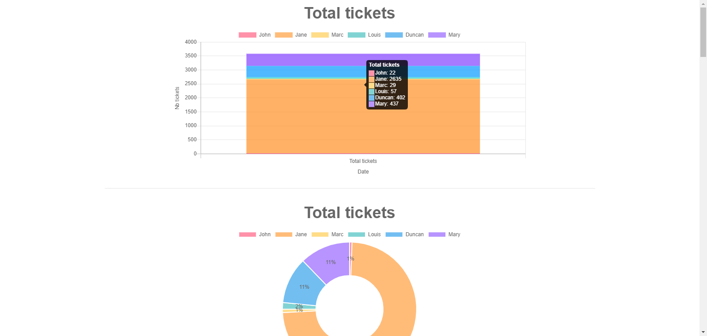

# ChartJS Report

<!-- vscode-markdown-toc -->
* 1. [Description](#Description)
* 2. [Usage](#Usage)
* 3. [Preview](#Preview)

<!-- vscode-markdown-toc-config
	numbering=true
	autoSave=true
	/vscode-markdown-toc-config -->
<!-- /vscode-markdown-toc -->

##  1. <a name='Description'></a>Description
This script generates a well presented ChartJS-based report for data visualization. The input format is a .csv file with naming conventions.

##  2. <a name='Usage'></a>Usage

Input .csv file must respect naming conventions, see below:


Execute the following command in a Powershell terminal
```
.\GenerateReport.ps1 [path to .csv file] [export path .html file]
```
If in the same directory:
```
.\GenerateReport.ps1 CapacityPlanning.csv CapacityPlanning.html
```
##  3. <a name='Preview'></a>Preview


